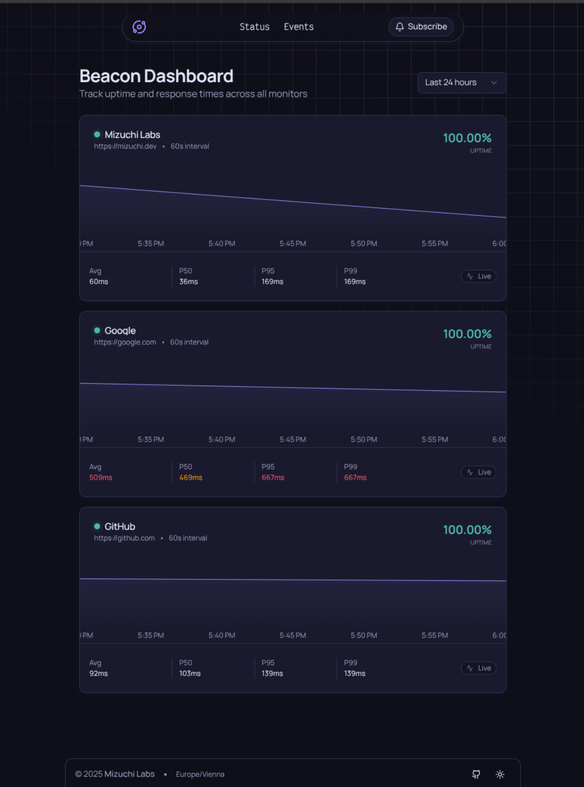
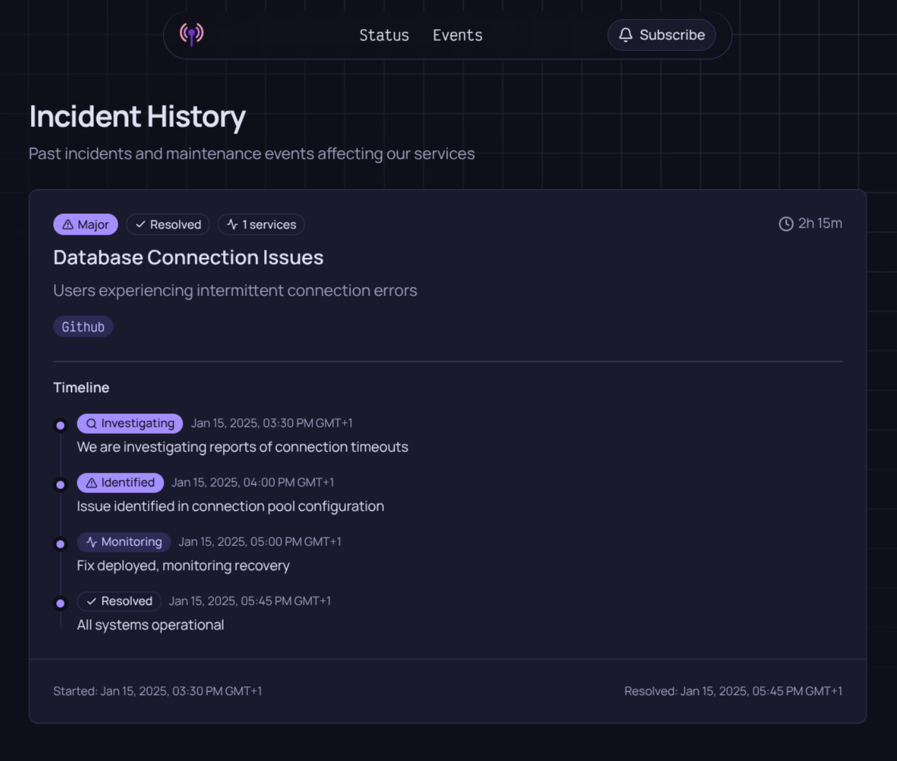

<p align="center">

<br><br>


</p>

# Beacon

A lightweight, self-hosted uptime monitoring solution that keeps track of your websites and services.

## Features

- ✅ HTTP/HTTPS endpoint monitoring
- 📊 Response time tracking
- 🔔 Notification system for downtime alerts
- 📝 Incident management with git-based storage
- 🎨 Clean dashboard interface
- 🐳 Docker-ready
- 💾 SQLite database for easy deployment
- 🔄 Automatic cleanup of old data

## Quick Start

### Using Docker

```bash
docker run -d \
   -p 3000:3000 \
   -v $(pwd)/data:/data \
   -e BEACON_CONFIG=/data/config.yaml \
   ghcr.io/mizuchilabs/beacon:latest
```

### Using Binary

```bash
beacon --config config.yaml
```

## Configuration

Beacon can be configured in two ways:

### 1. Configuration File (Recommended)

Create a `config.yaml` file:

```yaml
monitors:
  - name: "My Website"
    url: "https://example.com"
    check_interval: 60 # seconds
  - name: "API Server"
    url: "https://api.example.com"
    check_interval: 30
```

Then start Beacon:

```bash
# Using file path
beacon --config config.yaml

# Or via environment variable
export BEACON_CONFIG=config.yaml
beacon
```

### 2. Environment Variable (Docker-friendly)

For containerized deployments, you can inject the entire configuration as a YAML string:

```bash
docker run -d \
   -p 3000:3000 \
   -e BEACON_MONITORS='
monitors:
  - name: "My Website"
    url: "https://example.com"
    check_interval: 60
' \
   ghcr.io/mizuchilabs/beacon:latest
```

## Environment Variables

| Variable                | Default            | Description                                        |
| ----------------------- | ------------------ | -------------------------------------------------- |
| `BEACON_PORT`           | `3000`             | Server port                                        |
| `BEACON_CONFIG`         | `config.yaml`      | Path to monitors configuration file                |
| `BEACON_MONITORS`       | -                  | YAML configuration as string (alternative to file) |
| `BEACON_DB_PATH`        | `data/beacon.db`   | SQLite database path                               |
| `BEACON_TIMEOUT`        | `30s`              | HTTP request timeout                               |
| `BEACON_INSECURE`       | `false`            | Skip TLS certificate verification                  |
| `BEACON_RETENTION_DAYS` | `30`               | Days to keep check history                         |
| `BEACON_TITLE`          | `Beacon Dashboard` | Dashboard title                                    |
| `BEACON_DESCRIPTION`    | `Track uptime...`  | Dashboard description                              |
| `BEACON_TIMEZONE`       | `Europe/Vienna`    | Display timezone                                   |
| `DEBUG`                 | `false`            | Enable debug logging                               |

### Incident Management

| Variable               | Default | Description                      |
| ---------------------- | ------- | -------------------------------- |
| `BEACON_INCIDENT_REPO` | -       | Git repository URL for incidents |
| `BEACON_INCIDENT_PATH` | -       | Local path for incident files    |
| `BEACON_INCIDENT_SYNC` | `5m`    | Sync interval for git updates    |

## Docker Compose Example

```yaml
services:
  beacon:
    image: ghcr.io/mizuchilabs/beacon:latest
    container_name: beacon
    ports:
      - "3000:3000"
    volumes:
      - ./data:/data
      - ./config.yaml:/config.yaml:ro
    environment:
      - BEACON_CONFIG=/config.yaml
      - BEACON_DB_PATH=/data/beacon.db
      - BEACON_RETENTION_DAYS=90
      - BEACON_TITLE=My Status Page
      - TZ=America/New_York
    restart: unless-stopped
```

## Incident Tracking

Beacon supports git-based incident management. Create incident files in YAML format:

```yaml
id: 2025-01-15-database-outage
title: Database Connection Issues
description: Users experiencing intermittent connection errors
severity: major # minor, major, critical
status: resolved # investigating, identified, monitoring, resolved
affected_monitors:
  - My Website
  - API Server
started_at: 2025-01-15T14:30:00Z
resolved_at: 2025-01-15T16:45:00Z
updates:
  - message: Investigating connection timeouts
    status: investigating
    created_at: 2025-01-15T14:30:00Z
  - message: All systems operational
    status: resolved
    created_at: 2025-01-15T16:45:00Z
```

Store incidents in a git repository and configure:

```bash
export BEACON_INCIDENT_REPO=https://github.com/your/incidents.git
export BEACON_INCIDENT_PATH=/data/incidents
```

## Building from Source

```bash
# Clone repository
git clone https://github.com/mizuchilabs/beacon.git
cd beacon || exit

# Build
go build -o beacon ./cmd

# Run
./beacon --config config.yaml
```

## Screenshots




## License

Apache License 2.0 - See [LICENSE](LICENSE)

## Contributing

Contributions are welcome! Please feel free to submit a Pull Request.
